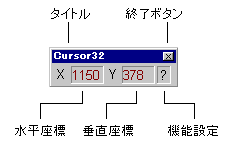
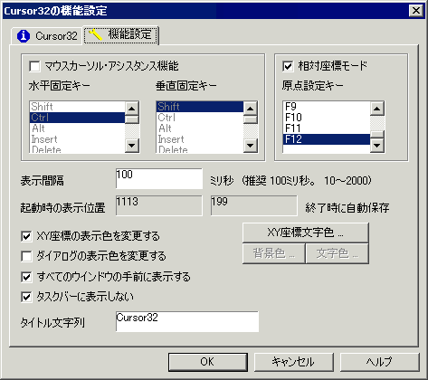

##   Cursor32 マウス座標表示 for Windows<!-- omit in toc -->

---
[Home](https://oasis3855.github.io/webpage/) > [Software](https://oasis3855.github.io/webpage/software/index.html) > [Software Download](https://oasis3855.github.io/webpage/software/software-download.html) > [cursor32](../cursor32/README.md) > ***cursor32*** (this page)

 
 

Last Updated : Apr. 2004

- [ソフトウエアのダウンロード](#ソフトウエアのダウンロード)
- [機能の概要](#機能の概要)
- [動作環境](#動作環境)
- [バージョンアップ情報](#バージョンアップ情報)
- [主な掲載雑誌](#主な掲載雑誌)
- [ライセンス](#ライセンス)

 
 

## ソフトウエアのダウンロード

-    [このGitHubリポジトリを参照する](../cursor32/download) 

-    [GoogleDriveを参照する](https://drive.google.com/drive/folders/0B7BSijZJ2TAHOWE1MzZlN2ItN2Y3NS00YTdjLWE1MWItYjVkNTM1NzZkZDFh?resourcekey=0-l2wWHRdmgBOriJj4txfBWg) 

 
 

## 機能の概要

小さなウインドウにマウスカーソル座標を表示します。ユーザの指定した任意のキーを押すと、マウスの動きを垂直・水平に固定することができます。 

-    マウスカーソルの現在位置を表示する。
-    マウスの動きを縦、横に真っ直ぐ制御する。(マウスカーソル アシスタント機能)
-    マウスカーソルの総移動距離を表示する。
-    ユーザによる機能の詳細設定可能（表示色、ホットキー、タイマー間隔、タイトル文字列など） 

 
 

 
 

## 動作環境

-    Windows 95/98/Me/NT/2000/XP/Vista/7 

-    MFC42.DLL および MSVCRT.DLL がシステムフォルダに存在すること

 
 

## バージョンアップ情報

-    Version 2.0 (1997/01/19)

     - [VerUp] Windows95対応32ビット･プログラム 
     - [NEW] 表示位置の保存 
     - [NEW] タイトル、表示間隔を設定可能に 
     - [NEW] レジストリに表示位置情報、表示間隔などを保存 
     - [NEW] 総移動距離の表示 

-    Version 2.5 (1999/03/03)

     - [BugFix] 総移動距離の計算で、起動時の過大加算の修正
     - [NEW] 座標表示色を変更可能に 
     - [NEW] インストール、アンインストール･ボタンの追加 
     - [NEW] ヘルプファイルのサポート 
     - [NEW] 表示位置の初期化レジストリファイルの添付 
     - [VerUp & BugFix] 表示位置が画面外にあるときの判定追加 
     - [VerUp] 表示位置リセットのレジストリ･ファイル追加 

-    Version 2.6 (1999/07/07)

     - [BugFix] 日本語版以外のWindows用に、メインダイアログをArialフォントとする 
     - [NEW] 全てのウインドウの手前に表示するの追加 
     - [NEW] タスクバーに表示しないの追加 
     - [NEW] ダイアログ本体の色変更の追加 
     - [VerUp] インストール、アンインストールをわかりやすくする 

-    Version 2.7 (2002/04/07)

     - [BugFix] 色データのレジストリ情報量を削減 
     - [NEW] ダイアログ表示色の即時反映 
     - [NEW] インストーラの更新 
     - [NEW] 英語リソースの添付 

-    Version 2.8 (2002/04/07)

     - [VerUp] セキュリティ耐性向上 

-    Version 2.9 (2004/04/17)

     - [NEW] 相対座標モードの追加 
     - [NEW] 同時起動の防止 

 
 

## 主な掲載雑誌

- ASCII Super Pack (アスキー) 
- DOS/V Magazine (ソフトバンク) 
- DOS/V USER (宝島社) 
- DOS/V Power Report (インプレス) 
- Pack for Windows (ベクター) 
- 使えるオンラインソフト (宝島社) 
- Windows 100% (晋遊舎) 
- インターネットスタート・ウインドウズＲｏｍ！（毎日コミュニケーションズ） 
- Windowsカスタマイズマニュアル （データハウス） 
- ウインドウズ・パワー（アスキー） 

 
 

## ライセンス

このソフトウエアは [GNU General Public License v3ライセンスで公開する](https://gpl.mhatta.org/gpl.ja.html) フリーソフトウエア
