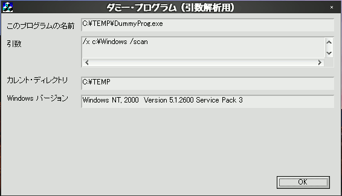

## （デバッグ用）引数表示ソフトウエア for Windows<!-- omit in toc -->

---
[Home](https://oasis3855.github.io/webpage/) > [Software](https://oasis3855.github.io/webpage/software/index.html) > [Software Download](https://oasis3855.github.io/webpage/software/software-download.html) > [dummyprog_paramdisp](../dummyprog_paramdisp/README.md) > ***dummyprog_paramdisp*** (this page)

 
 

Last Updated : Feb. 2002

- [ソフトウエアのダウンロード](#ソフトウエアのダウンロード)
- [機能の概要](#機能の概要)
  - [インストール、アンインストール](#インストールアンインストール)
- [動作環境](#動作環境)
- [バージョンアップ情報](#バージョンアップ情報)
- [ライセンス](#ライセンス)

 
 

## ソフトウエアのダウンロード

-    [このGitHubリポジトリを参照する](../dummyprog_paramdisp/download) 

 
 

## 機能の概要

プログラム（DummyProg.exe）起動時に指定された引数を表示する。ソフトウエア開発時のテスト用を想定して作成されている。 

### インストール、アンインストール

インストール操作は不要。適当なフォルダにDummyProg.exeを置くだけ。レジストリや設定ファイルは一切使用していない。 

アンインストールはDummyProg.exeを消去するだけ。レジストリや設定ファイルなどは一切用いていないため、意識してアンインストール処理する必要はない。 

 
 

## 動作環境

- Windows 95/98/98SE/Me/2000/XP/Vista 等
- MFC42.DLL および MSVCRT.DLL がシステムフォルダに存在すること

## バージョンアップ情報

- Version 1.0 (2002/02/17)

 
 

## ライセンス

このソフトウエアは [GNU General Public License v3ライセンスで公開する](https://gpl.mhatta.org/gpl.ja.html) フリーソフトウエア

