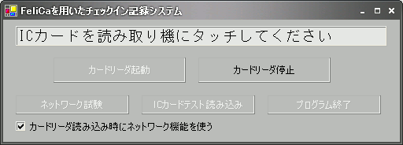
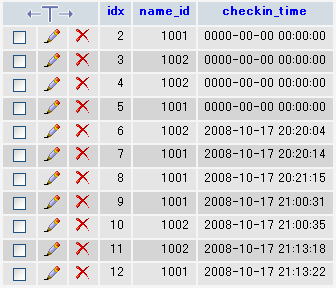

##   FeliCaを用いたクライアント・サーバ型のタイムカードシステム FeliCa(PaSoRi) Check-in Server/Client System for Windows<!-- omit in toc -->

---
[Home](https://oasis3855.github.io/webpage/) > [Software](https://oasis3855.github.io/webpage/software/index.html) > [Software Download](https://oasis3855.github.io/webpage/software/software-download.html) > [felica_pasori_checkin_system](../felica_pasori_checkin_system/README.md) > ***felica_pasori_checkin_system*** (this page)

 
 

Last Updated : Oct. 2008

- [ソフトウエアのダウンロード](#ソフトウエアのダウンロード)
- [機能の概要](#機能の概要)
- [配布ファイルの内容説明](#配布ファイルの内容説明)
- [動作環境](#動作環境)
  - [動作確認済み環境](#動作確認済み環境)
  - [ソースコードのビルド環境](#ソースコードのビルド環境)
- [バージョンアップ情報](#バージョンアップ情報)
- [ライセンス](#ライセンス)
  - [FeliCa(PaSoRi) Check-in Server/Client System](#felicapasori-check-in-serverclient-system)
  - [DllFelicaLib.dll およびそのソースコード](#dllfelicalibdll-およびそのソースコード)

 
 

## ソフトウエアのダウンロード

-    [このGitHubリポジトリを参照する](../felica_pasori_checkin_system/download) 

-    [GoogleDriveを参照する](https://docs.google.com/open?id=0B7BSijZJ2TAHYjY2Y2FiZGEtMThjMS00ZDdlLWI3MzMtZGJiMGUwNTBlMWY5) 

## 機能の概要

SuicaやICOCAなどFeliCaを用いたICカードを用いて、出勤簿の自動作成や、パソコンの個人認証などを製作する時に利用する、ICカード読み込みとWebサーバとの情報のやり取りのコアコンポーネントです。 なお、配布ファイルはこのままで利用されることを想定していないため、例外処理やセキュリティなど全く考慮されていません。また、データベースに蓄積されたチエックイン・ログを閲覧するソフトウエアも付属していません。

この配布ファイルにはソースコードを全て付属させていますので、社内SEやプログラマを雇用している企業において、内製でこれらのシステムを製作するために使われることを目的としています。

**通常、有償で販売されていることが多い、ネットワーク対応型の非接触ICカード勤怠システムを、完全無償で内製することが出来ます。**

 
 

クライアント（Windowsマシン）でのカード読み取り時の画面表示 

サーバのデータベースに蓄積されるデータの例

 

##  配布ファイルの内容説明 

このシステムは、次の3種類のプログラムから構成されています。それぞれのプログラムに適用される利用許諾契約は異なりますので注意してください。

- Pasoli_checkin.exe クライアント側ソフトウエア （GNU GPLフリーソフトウエア） 

  .NET Framework 1.1 対応版 

  ソースコード（.NET C#）を全て付属させています。 

  サーバアドレス等を利用環境に合わせて修正し、コンパイルしなおしてください。 サーバ側（Perl）の文字エンコード形式がSJISを想定していますので、UTF-8でエンコードされている場合は、ソースコードのコメントを参照の上、必要箇所を修正してください。 

- DllFelicaLib.dll 同上用DLLファイル （BSDライセンスソフトウエア） 

  Pasoli_checkin.exeと同じフォルダに保存してください。 

  ソースコード（Visual C++）を全て付属させていますが、通常はこのDLLを再コンパイルする必要性はあありません。（ユーザ環境が変更された場合でも、全て C#とPerl側で対応する） 

- pasoli_checkin.cgi Perlスクリプト （GNU GPLフリーソフトウエア） 

  Webサーバに置いて、Pasoli_checkin.exeからアクセスできる状態にしてください。また、このスクリプトから利用できるデータベースサーバ（MySQLなど）が必要です。 

  スクリプトは、SQLサーバの仕様にあわせて必ず変更してください。（サーバアドレスや、ユーザ名、パスワードなど全て） 

  なお、スクリプトはSJISで保存されることを意図しています。UTF-8で保存する場合は、スクリプト中のコメントを読み、必要箇所を変更してください。 

- DB_prepare.sql 

  MySQLの場合のテーブル作成スクリプトファイル 

## 動作環境

### 動作確認済み環境

-  クライアント側 

   - Windows XP日本語版 
   - .NET Framework 1.1 （2, 3 でもコンパイラにより対応可能） 
   - ソニー製 PaSoLi RC-S320 市価 2500円程度 
   - 同上用ドライバソフトウエア（FeliCaポートソフトウエア） 

-  サーバ側 

   - Linux ： RHEL 5.2 または CentOS 5.2 
   - Apache ： 2.2.3 
   - MySQL ： 5.0.22 
   - Perl ： 5.8.8 

### ソースコードのビルド環境

  Pasoli_checkin.exe には、.NET C#プログラム Visual C# （マイクロソフトから無償版も公開されています）

  DllFelicaLib.dll には、Visual C++ （Win32がコンパイルできる有償版） 

## バージョンアップ情報

-  Version 1.01 (2008/10/18)

    当初バージョン（公開用） 

-  Version 1.02 (2008/10/20)

    サーバURLを起動時引数またはプログラム中で再設定出来るよう変更 

## ライセンス

### FeliCa(PaSoRi) Check-in Server/Client System
このソフトウエアは [GNU General Public License v3ライセンスで公開する](https://gpl.mhatta.org/gpl.ja.html) フリーソフトウエア

### DllFelicaLib.dll およびそのソースコード
なお、DllFelicaLib.dll およびそのソースコードは [BSDライセンス（3条項BSDライセンス）で公開する](https://licenses.opensource.jp/BSD-3-Clause/BSD-3-Clause.html) フリーソフトウエア
(C) Copyright 2007, INOUE. Hirokazu and [Takuya Murakami](http://felicalib.tmurakam.org/)

