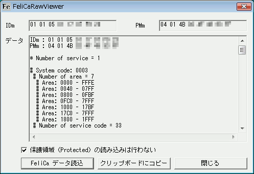

##   FeliCaのデータを読み出す FeliCa Raw Viewer for Windows<!-- omit in toc -->

---
[Home](https://oasis3855.github.io/webpage/) > [Software](https://oasis3855.github.io/webpage/software/index.html) > [Software Download](https://oasis3855.github.io/webpage/software/software-download.html) > [felica_raw_viewer](../felica_raw_viewer/README.md) > ***felica_raw_viewer*** (this page)

 
 

Last Updated : Nov. 2007

- [ソフトウエアのダウンロード](#ソフトウエアのダウンロード)
- [機能の概要](#機能の概要)
- [動作環境](#動作環境)
  - [動作確認済みFeliCaカード](#動作確認済みfelicaカード)
  - [ソースコードのビルド環境](#ソースコードのビルド環境)
- [バージョンアップ情報](#バージョンアップ情報)
- [ライセンス](#ライセンス)
  - [FeliCa Raw Viewer (FelicaLib部分を除く)](#felica-raw-viewer-felicalib部分を除く)
  - [FelicaLib およびそのソースコード](#felicalib-およびそのソースコード)

 
 

## ソフトウエアのダウンロード

-    [このGitHubリポジトリを参照する](../felica_raw_viewer/download) 

-    [GoogleDriveを参照する](https://drive.google.com/drive/folders/0B7BSijZJ2TAHY2I4YWQyODAtMmE5Yy00MGMwLWI0ZWMtNGEyOWEyNDhkOTRk?resourcekey=0-k17BRrDDq0JnLVM3GkwT-g)

 
 

## 機能の概要

FeliCa ICカードの情報 （非保護領域） を読み出して表示します。

FeliCaとの通信に[felicalib ライブラリ](http://felicalib.tmurakam.org/) Version 0.3 を利用しています。 

 
 

## 動作環境

### 動作確認済みFeliCaカード

- Suica 
- ICOCA 
- PiTaPa 
- ANAマイレージクラブカード （Edy機能つき） 
- みずほ銀行 マイレージクラブカード （キャッシュカード＋Master＋Edy＋ANA） 
- 香港 八達通 （オクトパスカード） → IDm, PMmのみ読み出し可能 

### ソースコードのビルド環境

- Microsoft Visual Studio C++ 6.0 

 
 

## バージョンアップ情報

-  Version 1.00 (2007/11/30) 

    当初バージョン（公開用） 

 
 

## ライセンス

### FeliCa Raw Viewer (FelicaLib部分を除く)
このソフトウエアは [GNU General Public License v3ライセンスで公開する](https://gpl.mhatta.org/gpl.ja.html) フリーソフトウエア

### FelicaLib およびそのソースコード
FelicaLib およびそのソースコードは [BSDライセンス（3条項BSDライセンス）で公開する](https://licenses.opensource.jp/BSD-3-Clause/BSD-3-Clause.html) フリーソフトウエア
(C) Copyright 2007, INOUE. Hirokazu and [Takuya Murakami](http://felicalib.tmurakam.org/)

