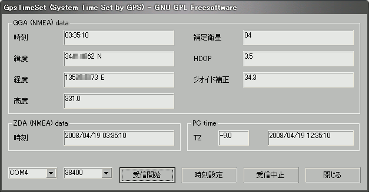
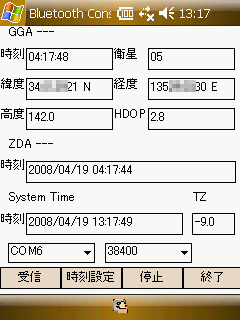

##   GPSによるシステム時間設定 GPS TIme Set for Windows/Windows Mobile<!-- omit in toc -->

---
[Home](https://oasis3855.github.io/webpage/) > [Software](https://oasis3855.github.io/webpage/software/index.html) > [Software Download](https://oasis3855.github.io/webpage/software/software-download.html) > [windows_misc_program ](../README.md) > ***gps_timeset*** (this page)

 
 

Last Updated : May. 2008

- [ソフトウエアのダウンロード](#ソフトウエアのダウンロード)
- [機能の概要](#機能の概要)
- [動作環境](#動作環境)
  - [Windows CE (Windows Mobile) 版](#windows-ce-windows-mobile-版)
  - [Windows (Win32) 版](#windows-win32-版)
- [バージョンアップ情報](#バージョンアップ情報)
- [ライセンス](#ライセンス)

 
 

## ソフトウエアのダウンロード

-    [このGitHubリポジトリを参照する](../gps_timeset/download) 

-    [GoogleDriveを参照する](https://drive.google.com/drive/folders/0B7BSijZJ2TAHZWFjZmEyNzQtOTQ4Zi00YTQ3LWI3NjEtY2YzZDlhZGJjNzcx?resourcekey=0-aYUOr8PbrWYa_BRisyOOKg) 

 
 

## 機能の概要

GPS受信で得られる時刻（UTC時刻）を用いて、システム時刻を修正（同期）します。 

 Windows版

 Windows CE 版

「COMポート」および「速度」を設定した後、「受信（受信開始）」ボタンを押すと、GPSからデータを受信します。

受信状態が安定したら、「時刻設定」ボタンを押すと、システム時刻がGPSデータを用いて設定されます。（Windows XP系の場合は、システム時刻設定の権限を持つユーザで実行してください）

「停止（受信中止）」ボタンを押すと、GPSデータの受信を終了します。（COMポートを閉じる）

 
 

## 動作環境

### Windows CE (Windows Mobile) 版

- Windows CE 4.2以降（Pocket PC 2003, Windows Mobile 5.0, 6） 
- MFCCE300.DLL および COREDLL.DLL がシステムフォルダに存在すること 

### Windows (Win32) 版

- Windows 95/98/98SE/Me/2000/XP/Vista/7 等 
- MFC71.DLL および MSVCR71.DLL がシステムフォルダに存在すること 

 
 

## バージョンアップ情報

-  Version 1.0 (2008/04/19) 

    当初

-  Version 1.0.1 (2008/05/31)

    「時刻設定」で年月日も設定対象にする（ZDA受信している場合のみ） 
    「時刻設定」の時差修正で、日をまたぐ場合の計算間違い（12時間ずれる）を修正 

 
 

## ライセンス

このソフトウエアは [GNU General Public License v3ライセンスで公開する](https://gpl.mhatta.org/gpl.ja.html) フリーソフトウエア

