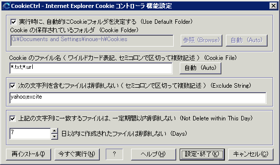

##   Internet Explorer Cookie コントローラ for Windows<!-- omit in toc -->

---
[Home](https://oasis3855.github.io/webpage/) > [Software](https://oasis3855.github.io/webpage/software/index.html) > [Software Download](https://oasis3855.github.io/webpage/software/software-download.html) > [windows_misc_program](../README.md) > ***ie_cookie_ctrl*** (this page)

 
 

Last Updated : May. 2002  **(Discontinued Software)**

- [ソフトウエアのダウンロード](#ソフトウエアのダウンロード)
- [機能の概要](#機能の概要)
  - [技術的解説](#技術的解説)
- [動作環境](#動作環境)
- [バージョンアップ履歴](#バージョンアップ履歴)
- [主な掲載誌](#主な掲載誌)
- [ライセンス](#ライセンス)

 
 

## ソフトウエアのダウンロード

-    [このGitHubリポジトリを参照する](../ie_cookie_ctrl/download) 
-    [Googleドライブを参照する](https://drive.google.com/drive/folders/0B7BSijZJ2TAHMDI3YWE0YmUtNzZjZS00ZjUzLThkYjMtMmFkYmJjMjVhNzI3?resourcekey=0-0wvm6IbV4p93ILebG8X0PA) 

 
 

## 機能の概要

Microsoft Internet Explorer（インターネット エクスプローラ）のCookieを、一定の条件をつけて一括削除するソフトウエア

最近のInternet Explorerには、Cookieを自動削除するセキュリティ機能がビルトインされているため、このソフトウエアは必要ありません

また、Windows 10以降でInternet Explorerが無効化／インストールされていない環境では、このソフトウエアを使わないでください

 
 

 機能設定ダイアログ

Internet Explorerでは、Cookieをデータファイルとして保存しています。このソフトウエアでは、このデータファイルを一定の条件（例えば、ファイルの日時やファイル名など）を決めて一括削除することができます。

ウエブサイトを訪問したときに作られるCookieデータには、訪問履歴やパスワード、入力履歴など何らかのデータが保存されている場合があります。これらのデータはユーザの訪問サイトや入力履歴に合わせた公告表示など「商業上の目的」で利用される場合や、こっそりと個人情報を収集するための「悪意の目的」をもって使われる場合もあります。

必要のないCookieは削除してしまうのが、個人情報を守るためには必要だという考えで作られたのがこのソフトウエアです。

### 技術的解説

レジストリより、Cookie の保存フォルダを検索して、そこにある指定拡張子（通常は *.txt）のファイルをCookieのデータファイルとみなして処理しています。 

 
 

## 動作環境

- Windows 95/98/Me/NT/2000/XP
- Internet Explorer Version 4, 5, 5.5, 6.0 （Edge, Chrome, Firefoxなどの他のブラウザでは機能しません）

 
 

## バージョンアップ履歴

- Version 1.0 (2001/03/04)

  - 公開用初版 

- Version 1.1 (2002/04/07)

  - インストーラの改良 
  - 英語版のリソース添付（Multi Language 対応） 
  - Cookie フォルダの自動取得オプション追加 

- Version 1.2 (2002/05/07)

  - セキュリティ耐性向上 

 
 

## 主な掲載誌

- ウインドウズ・パワー（アスキー） 
- Windows2000 World （ＩＤＧジャパン） 
- DOS/V Magazine （ソフトバンク） 
- iP （晋遊舎） 
- テックウイン（アスキー） 
- インターネットスタート・ウインドウズＲｏｍ！（毎日コミュニケーションズ） 
- CD-ROM Fan （毎日コミュニケーションズ） 
- ネットランナー （ソフトバンク） 
- PC GIGA 
- Windows XPではじめるウイルスの予防、発見、駆除 （秀和システム） 
- SOFTWARE TERMINOLOGY （二見書房） 

 
 

## ライセンス

このソフトウエアは [GNU General Public License v3ライセンスで公開する](https://gpl.mhatta.org/gpl.ja.html) フリーソフトウエア

