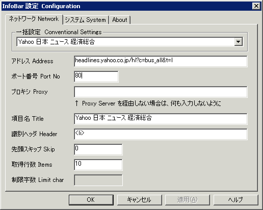

##   InfoBar ニュース電光掲示板 for Windows <!-- omit in toc -->

---
[Home](https://oasis3855.github.io/webpage/) > [Software](https://oasis3855.github.io/webpage/software/index.html) > [Software Download](https://oasis3855.github.io/webpage/software/software-download.html) > [infobar](../infobar/README.md) > ***infobar*** (this page)

 
 

Last Updated : Jun. 2003

- [ソフトウエアのダウンロード](#ソフトウエアのダウンロード)
- [機能の概要](#機能の概要)
  - [制限事項](#制限事項)
- [動作環境](#動作環境)
- [バージョンアップ情報](#バージョンアップ情報)
- [主な掲載雑誌](#主な掲載雑誌)
- [ライセンス](#ライセンス)

 
 

## ソフトウエアのダウンロード

-    [このGitHubリポジトリを参照する](../infobar/download) 

-    [GoogleDriveを参照する](https://drive.google.com/drive/folders/0B7BSijZJ2TAHMDdmNWI1NjAtZmE3My00YjczLWEyOWUtMTQ2OWVmZjBjNWU1?resourcekey=0-8tBgi1nhT1pbOe1SD2HQOg) 

 
 

## 機能の概要

電光掲示板風のミニウインドウに、インターネットから取得したニュースを横スクロール表示するソフトウエア

 横スクロールでニュースを表示します 

 

 設定ダイアログ

 

ユーザが任意のサイトを登録することができます。受信したHTMLファイルから記事を切り取る条件も、ある程度設定することができます。ウインドウの色や横スクロール速度もユーザが設定可能です。

### 制限事項

情報を取得する相手先ウエブページの応答が遅い場合、プログラムが一時的に固まったり、情報の取得がうまく出来なくなることがあります。ネット接続のエラーが起こった場合は、ニュース記事ではなくエラーメッセージを表示します。

画面のカラーモードはフルカラー以外は考慮していません。

私が通常訪問するニュース サイト以外ではソフトウエアの検証を行っていません。 

 
 

## 動作環境

-    Windows 95/98/Me/NT/2000/XP 

 
 

## バージョンアップ情報

-    Version 0.01 (2002/08/29)

     - 一応公開用に、ヘルプファイルなど作ってみました。 

-    Version 0.02 (2002/09/02)

     - Shift-JIS / EUC 判定のバグフィックス 
     - 時事通信社、朝日新聞、Bloomberg、ＣＮｅｔ、ＺＤｎｅｔを追加 

-    Version 0.03 (2002/09/04)

     - Shift-JIS / EUC 判定のバグフィックス 
     - 文字列書き換え時の内部処理を最適化（ビットマップ処- 理を総当り法から２分法へ変更） 
     - フォント変更、ダイアログサイズ変更を可能にする 
     - インストーラでヘルプの表示が可能になる 
     - 右クリックメニューから直接ヘルプを呼び出せる 
     - 産経新聞、首都圏ＪＲ運行情報を追加 

-    Version 0.04 beta1 (2002/09/15)

     - 文字列切り出しのバグフィックス 
     - winsock 初期化のバグフィックス 
     - ネットワーク処理部分（スレッド）の非MFC化による大幅な書き直し 
     - winsock 1.1 での IP アドレスを直接指定した場合への対応 
     - ホスト名の解決の効率化 
     - winsock の終了処理のバグフィックス 
     - ネットワークエラーのエラーコードを表示するように変更 
     - スレッドの重複起動防止 
     - スレッド動作中の表示（ウインドウの左上に表示追加） 
     - 証券モード追加（テスト用） 

-    Version 0.04 beta2 (2002/09/20)

     - 微調整 
     - デバッグモードの追加 

-    Version 0.04 beta3 (2002/09/20)

     - ダブルクリックでブラウザで開く機能を追加 

-    Version 0.04 (2002/09/27)

-    Version 0.041 (2003/06/01)

     - バッファオーバーフロー対策（ダイアログ設定からスレッド通信変数へのコピー段階） 
     - 空白文字の削除オプション 
     - 全行一行化（改行コード→空白文字）のオプション 
     - ＨＴＭＬ受信バッファを 100 kBytes → 150 kBytes 
     - データバッファ 2048 Bytes → 4096 Bytes 
     - 仮想BMPを横5000pix→8000pix 
     - 一括設定のプリセットサイトのアップデート 
     - 証券モードで一括条件を変更するとコードリストにサンプルを自動入力 
     - 証券モードの日本株式リストをアップデート（取引高大きいものに入れ替えなど） 
     - ポート番号の自動入力を、項目が未入力の場合のみに変更 
     - メインダイアログの形式を変更（XPでボーダーが太くなった不具合対応。くぼみ形式へ） 

 
 

## 主な掲載雑誌

- インターネットスタート・ウインドウズＲｏｍ！（毎日コミュニケーションズ） 
- DOS/V Magazine (ソフトバンク) 

 
 

## ライセンス

このソフトウエアは [GNU General Public License v3ライセンスで公開する](https://gpl.mhatta.org/gpl.ja.html) フリーソフトウエア

