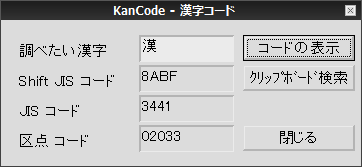

##   日本語文字コード表示ツール for Windows<!-- omit in toc -->

---
[Home](https://oasis3855.github.io/webpage/) > [Software](https://oasis3855.github.io/webpage/software/index.html) > [Software Download](https://oasis3855.github.io/webpage/software/software-download.html) > [windows_misc_program](../README.md) > ***kanjicode*** (this page)

 
 

Last Updated : Oct. 1998

- [ソフトウエアのダウンロード](#ソフトウエアのダウンロード)
- [機能の概要](#機能の概要)
- [動作環境](#動作環境)
- [インストール／アンインストール方法](#インストールアンインストール方法)
- [バージョンアップ情報](#バージョンアップ情報)
- [ライセンス](#ライセンス)

 
 

## ソフトウエアのダウンロード

-    [このGitHubリポジトリを参照する](../kanjicode/download) 

 
 

## 機能の概要

入力された１文字（日本語）をShift JIS、JIS、区点のそれぞれの16進コードで表示します。なお、拡張領域のコードの変換に一部バグがあります。 

 
 

## 動作環境

- Windows 95/98/98SE/Me/2000/XP/Vista 等
- MFC42.DLL および MSVCRT.DLL がシステムフォルダに存在すること 

 
 

## インストール／アンインストール方法

インストール操作は不要。適当なフォルダにKanCode.exeを置くだけ。レジストリや設定ファイルは一切使用していない。 
アンインストールはKanCode.exeファイルを削除するのみ。

 
 

## バージョンアップ情報

-  Version 1.00 (1998/10/30) 

 
 

## ライセンス

このソフトウエアは [GNU General Public License v3ライセンスで公開する](https://gpl.mhatta.org/gpl.ja.html) フリーソフトウエア

