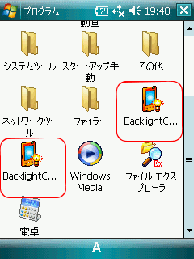
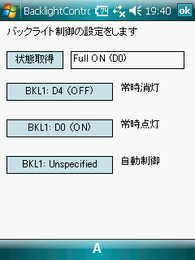
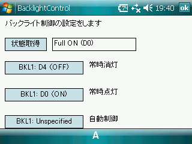
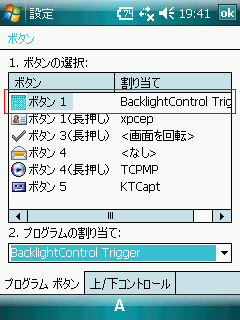
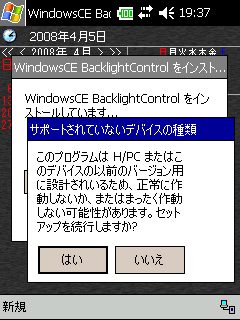
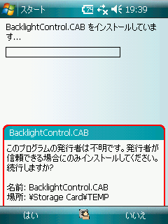

##   バックライト制御 Backlight Control for Windows Mobile<!-- omit in toc -->

---
[Home](https://oasis3855.github.io/webpage/) > [Software](https://oasis3855.github.io/webpage/software/index.html) > [Software Download](https://oasis3855.github.io/webpage/software/software-download.html) > [windows_misc_program ](../README.md) > ***winmobile_backlight_ctrl*** (this page)

 
 

Last Updated : Apr. 2008

- [ソフトウエアのダウンロード](#ソフトウエアのダウンロード)
- [機能の概要](#機能の概要)
  - [機能確認用 BacklightControl Demo](#機能確認用-backlightcontrol-demo)
  - [ボタンに登録する BacklightControl Trigger](#ボタンに登録する-backlightcontrol-trigger)
- [インストール、アンインストール](#インストールアンインストール)
  - [インストール時の注意](#インストール時の注意)
- [バージョンアップ情報](#バージョンアップ情報)
- [ライセンス](#ライセンス)

 
 

## ソフトウエアのダウンロード

-    [このGitHubリポジトリを参照する](../winmobile_backlight_ctrl/download) 

-    [GoogleDriveを参照する](https://drive.google.com/drive/folders/0B7BSijZJ2TAHYmY1ZWE3MTQtNjlmMC00NmVhLTk0OTYtY2M3NTcwZjMzNjNl?resourcekey=0-58YN6mkMySIbf7HWetMTgw) 

 
 

## 機能の概要

Windows MobileのバックライトON・OFF制御を、ボタンを押して行えるようにするためのソフトウエア

このソフトウエアは、バックライトの点灯状態を反転させるトリガ プログラム（BacklightControl Trigger）と、機能確認用に画面上に状態表示と点灯・消灯のボタンを表示するプログラム（BacklightControl Demo）の２種類で構成されています。ソフトウエアをインストールすると、この２種類がスタートメニューに登録されます。 

 スタートメニューに登録された２種類のメニュー

### 機能確認用 BacklightControl Demo

スタートメニューのBacklightControlを実行すると、機能確認用のプログラムが起動します。

機能確認用プログラム（BacklightControl）は、画面の回転にも対応しています。

 縦画面表示

 横画面表示

### ボタンに登録する BacklightControl Trigger

Windows Mobileのボタン設定ダイアログで、任意のボタンに割付を行います。

 ボタン設定ダイアログ

 
 

## インストール、アンインストール

インストールは、ファイルエクスプローラなどで、配布しているCABファイル実行（タップ）します。

アンインストールは、コントロールパネルのプログラムの削除で「WindowsCE BacklightControl」を削除します。 

### インストール時の注意

ソフトウエアのインストール時に「以前のバージョン用に設計されているため、正常に作動しないか、またはまったく作動しない可能性があります。セットップを実行します か？」という警告が表示されたり、「このプログラムの発行者は不明です。続行しますか？」という警告が表示されますが、通常そのままインストールして問題ありません。 

 警告表示 Pocket PC 2003

 警告表示 Windows Mobile 6

 
 

## バージョンアップ情報

-  Version 1.0 (2008/04/05)  

    当初

 
 

## ライセンス

このソフトウエアは [GNU General Public License v3ライセンスで公開する](https://gpl.mhatta.org/gpl.ja.html) フリーソフトウエア

